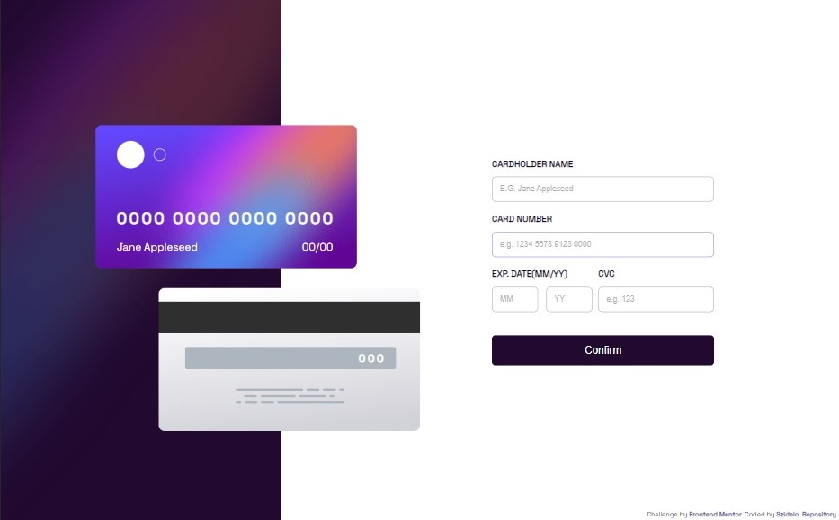
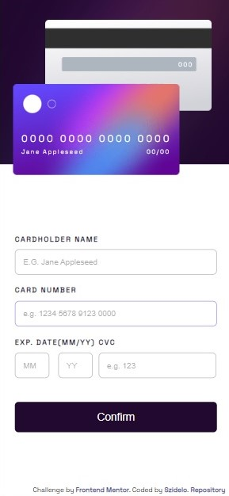

# Frontend Mentor - Interactive card details form solution

This is a solution to the [Interactive card details form challenge on Frontend Mentor](https://www.frontendmentor.io/challenges/interactive-card-details-form-XpS8cKZDWw). Frontend Mentor challenges help you improve your coding skills by building realistic projects. 

## Table of contents

- [Overview](#overview)
  - [The challenge](#the-challenge)
  - [Screenshot](#screenshot)
  - [Links](#links)
- [My process](#my-process)
  - [Built with](#built-with)
  - [What I learned](#what-i-learned)
  - [Continued development](#continued-development)
  - [Useful resources](#useful-resources)
- [Author](#author)
- [Acknowledgments](#acknowledgments)


## Overview

### The challenge

Users should be able to:

- Fill in the form and see the card details update in real-time
- Receive error messages when the form is submitted if:
  - Any input field is empty
  - The card number, expiry date, or CVC fields are in the wrong format
- View the optimal layout depending on their device's screen size
- See hover, active, and focus states for interactive elements on the page

### Screenshot





### Links

- Solution URL: [Add solution URL here](https://www.frontendmentor.io/solutions/javascript-if-statements-position-absolute-flexbox-media-query-css-Tb3qlZZwlT)
- Live Site URL: [Add live site URL here](https://szidelo.github.io/Frontend_mentor_interactiv/)

## My process

### Built with

- Semantic HTML5 markup
- CSS custom properties
- Flexbox
- Vanilla javascript

### What I learned

The most challenging aspect of styling was precisely positioning the SVG elements and their corresponding content within the cards. While doing this i've learned how to position content over a SVG.

Additionally, implementing the logic for error messages posed a significant difficulty. It required ensuring that the appropriate error message was displayed, preventing form submission in the presence of errors, and allowing form submission once the errors were rectified in the input fields. I am not sure that this is the best way to do this but what I've done is to create a function validateForm. This function performs form validation by checking input fields for errors. Error messages are displayed or hidden based on the validation results. If any errors are found, the function returns true, indicating the presence of errors. The confirmButton event listener is triggered when the "confirm" button is clicked. It prevents the default form submission behavior and calls the validateForm function. If no errors are found, it toggles the visibility of the form and completed form sections.

See below:

```js
	// Function to validate cardholder name
	const validateName = () => {
		const cardholderNameInput = document.getElementById("cardholder-name");
		const nameErrorPara = document.getElementById("nameError");

		if (cardholderNameInput.value === "") {
			nameErrorPara.classList.remove("hidden");
			nameErrorPara.innerText = "Can't be blank";
			return true;
		}

		nameErrorPara.classList.add("hidden");
		nameErrorPara.innerText = "";
		return false;
	};

	// Function to validate cardholder number
	const validateNumber = () => {
		const cardholderNumberInput = document.getElementById("card-number");
		const numberErrorPara = document.getElementById("numberError");

		if (cardholderNumberInput.value === "") {
			numberErrorPara.classList.remove("hidden");
			numberErrorPara.innerText = "Can't be blank";
			return true;
		} else if (
			cardholderNumberInput.value.length !== 16 ||
			!/^\d+$/.test(cardholderNumberInput.value)
		) {
			numberErrorPara.classList.remove("hidden");
			numberErrorPara.innerText = "Must contain 16 digits and only numbers";
			return true;
		}

		numberErrorPara.classList.add("hidden");
		numberErrorPara.innerText = "";
		return false;
	};

	// Function to validate card expiration date
	const validateDate = () => {
		const cardholderMounthInput = document.getElementById("card-mounth");
		const cardholderYearInput = document.getElementById("card-year");
		const dateErrorPara = document.getElementById("dateError");

		if (
			cardholderMounthInput.value === "" ||
			cardholderYearInput.value === ""
		) {
			dateErrorPara.classList.remove("hidden");
			dateErrorPara.innerText = "Can't be blank";
			return true;
		} else if (
			cardholderMounthInput.value.length > 2 ||
			cardholderYearInput.value.length > 4 ||
			cardholderMounthInput.value > 12 ||
			cardholderYearInput.value < 23
		) {
			dateErrorPara.classList.remove("hidden");
			dateErrorPara.innerText = "Must contain a valid date";
			return true;
		}

		dateErrorPara.classList.add("hidden");
		dateErrorPara.innerText = "";
		return false;
	};

	// Function to validate CVV
	const validateCVV = () => {
		const cardholderCvvInput = document.getElementById("card-cvv");
		const cvvErrorPara = document.getElementById("cvvError");

		if (cardholderCvvInput.value === "") {
			cvvErrorPara.classList.remove("hidden");
			cvvErrorPara.innerText = "Can't be blank";
			return true;
		}

		cvvErrorPara.classList.add("hidden");
		cvvErrorPara.innerText = "";
		return false;
	};

	// Function to validate the entire form
	const validateForm = () => {
		const nameError = validateName();
		const numberError = validateNumber();
		const dateError = validateDate();
		const cvvError = validateCVV();

		return nameError || numberError || dateError || cvvError;
	};

	confirmButton.addEventListener("click", (event) => {
		event.preventDefault();
		if (!validateForm()) {
			toggleFormVisibility();
		}
	});
```

### Continued development

I am confident that I can enhance the styling of this project, and I plan to do so in the coming days. One aspect I particularly want to improve is the responsiveness for tablets, and I also aim to incorporate some animations. I am not entirely satisfied with the current approach of using absolute positioning for the cards, as it feels tedious. Additionally, I also have a lot of repetition in the validateForm logic, which I find undesirable.

## Author

- Github - [Szidelo](https://github.com/Szidelo)
- Frontend Mentor - [@Szidelo](https://www.frontendmentor.io/profile/Szidelo)
- LinkedIn - [Szidelo Claudiu](https://www.linkedin.com/in/claudiu-szidelo-671b1324a/)
